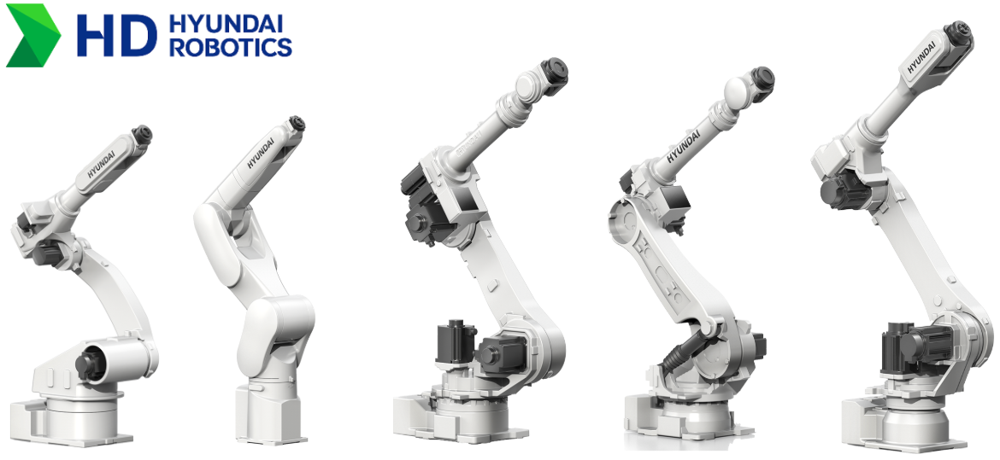
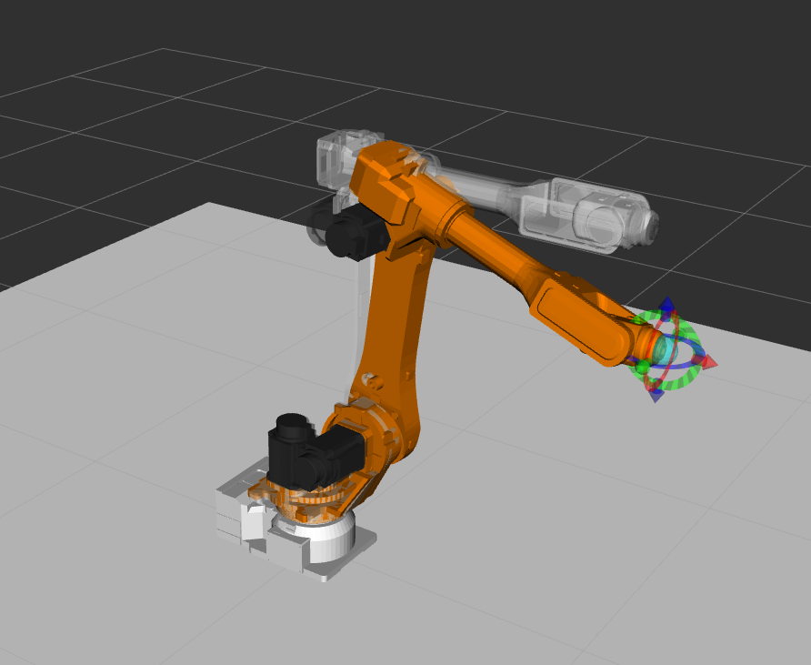

# HD Hyundai Robotics ROS2 Driver

#### Table of Contents
- [Overview](#1-overview)
- [Repository Structure](#2-repository-structure)
- [Installation](#3-installation)
- [Usage](#4-usage)
- [Troubleshooting](#5-troubleshooting)

---

## 1. Overview
<div align="center"></div>
This repository provides the HD Hyundai Robotics ROS2 driver, including nodes that enable communication with HD Hyundai Robotics industrial robot controllers (Hi6 series). The currently supported controller models are:

- Hi6-N10
- Hi6-N20
- Hi6-N00 (HK)
- Hi6-N30 (HK)
- Hi6-N80 (HK)
- Hi6-T15

> ❗**Note:** The HD Hyundai Robotics ROS2 driver does **not** support the Hi5a controller.  
> &nbsp;&nbsp;&nbsp;&nbsp;&nbsp;&nbsp;&nbsp;&nbsp;&nbsp;&nbsp;&nbsp;&nbsp;&nbsp;&nbsp;&nbsp;&nbsp;&nbsp;&nbsp;
The controller software must be updated to version **v60.34-00** or later.
This version is planned for release in **Q2 2026**.
> &nbsp;&nbsp;&nbsp;&nbsp;&nbsp;&nbsp;&nbsp;&nbsp;&nbsp;&nbsp;&nbsp;&nbsp;&nbsp;&nbsp;&nbsp;&nbsp;&nbsp;&nbsp;All REST API-based communication requires the robot to be in REMOTE mode.

The currently supported robot models are:
- ha006b [[HA006B](https://hd-hyundairobotics.com/biz/product/detail/7)]
- hdf7_9 [[HDF7-9 (HH7)](https://hd-hyundairobotics.com/biz/product/detail/4)]
- hdf8_8 [[HDF8-8 (HH8)](https://hd-hyundairobotics.com/biz/product/detail/6)]
- hdr10l_19 [[HDR10L-19 (UH010L)](https://hd-hyundairobotics.com/biz/product/detail/84)]
- hdr20_17 [[HDR20-17 (UH020)](https://hd-hyundairobotics.com/biz/product/detail/40)]
- hdr50_22 [[HDR50-22 (HH050)](https://hd-hyundairobotics.com/biz/product/detail/14)]
- hdr220_26 [[HDR220-26 (HS220)](https://hd-hyundairobotics.com/biz/product/detail/21)]
- hh020 [[HH020](https://hd-hyundairobotics.com/biz/product/detail/11)]
- hdr35_20 [[HDR35-20(UH035)](https://www.hd-hyundairobotics.com/biz/product/detail/41)]

> ❗**Note:** The robot models `hdf7_9`, `hdf8_8`, `hdr50_22`, `hdr220_26`, and `hdr35_20` are updated names for the previously known models `HH7`, `HH8`, `HH050`, `HS220`, and `UH035` respectively.

---

## 2. Repository Structure
This repository contains the following packages:
| Package                  | Description                                                                                  |
|--------------------------|----------------------------------------------------------------------------------------------|
| `hdr_bringup/`           | Contains launch files for bringing up a physical robot using ROS2.                           |
| `hdr_hardware_interface/`| A `ros2_control` `SystemInterface` that integrates the HD Hyundai Robotics Open API (HTTP) with the ROS2 control loop. |
| `hdr_moveit_config/`     | MoveIt2 configuration packages for controlling HD Hyundai Robotics robots (both real and simulated).      |
| `hdr_msgs/`              | Custom message definitions used by the HDR ROS2 driver.                                        |
| `hdr_ros2_driver/`       | Contains core ROS2 nodes and logic for communicating with the robot controller.            |

---

## 3. Installation
### Prerequisite ROS2 Packages (Manual Installation Required)

The following ROS2 packages **must be manually cloned and built** from source:

- `hdr_description`  Clone and build from source: [[hdr_description](https://github.com/hyundai-robotics/hdr_description)]
- `hdr_client_driver`  Clone and build from source: [[hdr_client_driver](https://github.com/hyundai-robotics/hdr_client_driver)]

### Build the package
#### Create a ROS2 workspace

```bash
# Skip if you already have a workspace
mkdir -p ~/ros2_ws/src/
```

#### Clone the latest repositories

```bash
cd ~/ros2_ws
git clone https://github.com/hyundai-robotics/hdr_ros2_driver src
```

#### Install ROS2 dependencies

```bash
rosdep update
rosdep install --from-paths src --ignore-src --rosdistro $ROS_DISTRO -y
```

#### Build and source enviroment
```bash
colcon build --symlink-install --cmake-args=-DCMAKE_BUILD_TYPE=Release
source install/setup.bash
```

---

## 4. Usage

> ⚠️ **WARNING:** Operating industrial robots without proper safety measures can lead to severe injury. Always verify that the workspace is clear and that the emergency stop is readily accessible before launching the ROS2 control interface.

> ⚠️ **WARNING:** Press the **emergency stop button** to ensure user safety when the physical communication between the PC and the controller is lost during industrial robot operation.

### Preparation
Before launching the ROS2 driver, ensure that your PC is properly connected to the robot controller via Ethernet. Refer to the following guide to verify successful communication between the PC and the robot controller: [hdr_ros2_driver README](hdr_ros2_driver/README.MD)


### Example

#### Bring up HDR robots using ROS2
After communication with the controller has been successfully established, you can use the following command to control the robot using **MoveIt** and **ros2_control**:

```bash
ros2 launch hdr_bringup hdr_moveit.launch.py robot_model:=ha006b
```
Replace `robot_model` with the actual model of your robot.<br>
Upon launch, RViz will open with MoveIt configured for the specified robot.

<div align="left"></div> 

<br>Alternatively, if you want to control the robot without using MoveIt, you can do so directly via **ros2_control** using the command below:

```bash
ros2 launch hdr_bringup hdr_control.launch.py robot_model:=ha006b
```


#### Enabling the robot for ROS2 control
Before issuing any control commands via ROS2, the robot must be **motor powered on** and set to **operation mode**.
These steps are essential to ensure that the robot is properly initialized and capable of executing commands through **ros2_control**.

In general, when the ROS2 driver is launched, the robot is already in a controllable state.
However, if the emergency stop has been triggered, the motor power has been turned off, or the system has been restarted, the robot must be re-enabled by following the procedures outlined below:

1. Turn on motor power
```bash
ros2 service call /hdr_ros2_driver/robot/post/motor_power std_srvs/srv/Trigger
```
2. Switch robot to operation mode (accept external control commands)
```bash
ros2 service call /hdr_ros2_driver/robot/post/operation std_srvs/srv/SetBool "data: true"
```


#### Configuration Options
The following launch arguments are available in `hdr_control.launch.py` and `hdr_moveit.launch.py`:

| Argument Name              | Type   | Default                   | Description                                                                 |
|----------------------------|--------|---------------------------|-----------------------------------------------------------------------------|
| `robot_model`              | string | `ha006b`                  | HDR robot model to use. Choose from `[ha006b, hdf7_9, hdf8_8, hdr10l_19, hdr20_17, hdr50_22, hdr220_26, hh020, hdr35_20]` |
| `openapi_ip`               | string | `192.168.1.150`           | IP address of the robot's OpenAPI server                                    |
| `command_buffer_size`   | int    | `5`                       | Buffer size for command data management                                  |
| `controllers_config_package`| string | `hdr_hardware_interface` | Package providing ROS2 controller configuration files                       |
| `controllers_file`         | string | `default_controllers.yaml`| YAML file defining controllers to load                                      |
| `kinematics_config_package`| string | `hdr_hardware_interface` | Package providing robot kinematics file                                      |
| `kinematics_file`          | string | `default_kinematics.yaml`| YAML file specifying the robot's kinematics                                  |


#### Setup the ROS2 controller
To configure which controllers will be used in your ROS2 system, you can modify the controller settings via the **controllers_file** parameter.<br>
By default, the file used is `default_controllers.yaml`, located in the `hdr_hardware_interface/config/` directory.<br>
The structure of this file defines both the active and inactive controllers at launch time.<br>
Below is the default configuration:

```yaml
controller_state:
 ros__parameters:
   active_controllers:
     - joint_state_broadcaster
     - joint_trajectory_controller
     
   inactive_controllers: []
```

You can freely list additional controllers under the **inactive_controllers** section, like in the following example:

```yaml
controller_state:
 ros__parameters:
   active_controllers:
     - joint_state_broadcaster
     - joint_trajectory_controller
     
   inactive_controllers:
     - custom_controller
```

Inactive controllers are not started by default, but they can be activated at runtime using standard **controller_manager** services such as:

```bash
ros2 control switch_controllers \
  --activate costum_controller \
  --deactivate joint_trajectory_controller
```

This allows for flexible runtime control of various controllers depending on your operational requirements, such as task changes, safety constraints, or robot modes.


#### hdr_moveit_config
This package provides MoveIt2 configurations for controlling HD Hyundai Robotics robots (simulated or real).
Configurations such as SRDF, controller settings, and kinematic parameters are defined per robot model under the `{robot_model}_moveit_config` sub-packages within `hdr_moveit_config`.

The `joint_limits.yaml` file located in the `{robot_model}_moveit_config/config` folder defines parameters for specifying scaling factors, which can also be adjusted via the RViz interface.
Due to current controller limitations, it is strongly recommended to use scaling factor values **no greater than 0.2** for stable operation.

```yaml
default_velocity_scaling_factor: 0.1
default_acceleration_scaling_factor: 0.1
```


### Configuring and Recovering from HDR Robot Power Saving Mode
#### Power Saving Function Configuration
Depending on the system settings, the device may automatically enter power saving mode. To configure or disable this feature on the teach pendant (TP), follow the steps below:

1. Touch the [2: Control Parameter > 1: Control Environment Setting] menu.
2. [Power saving function]: You can enable or disable the power saving function to suit your operational requirements.
<div align="left"></div> 

> **Recommendation**: For continuous operation or to avoid unexpected interruptions, consider disabling the power saving function entirely.

#### Recovery from Power Saving Mode
If the robot enters power saving mode and becomes unresponsive, you can recover it using one of the following methods:

1. Press the emergency stop button on the robot
2. Release the emergency stop button
3. Turn on motor power via ROS2 service
```bash
ros2 service call /hdr_ros2_driver/robot/post/motor_power std_srvs/srv/Trigger
```
4. Switch robot to operation mode via ROS2 service (accept external control commands)
```bash
ros2 service call /hdr_ros2_driver/robot/post/operation std_srvs/srv/SetBool "data: true"
```

> **Note**: If you frequently encounter power saving mode issues during operation, use the configuration menu above to disable the power saving function permanently.

### When the robot does not operate in Motor ON & Start Mode
#### Normal Operation
When both **Motor ON** and **Start Mode** are enabled, the robot operates normally.

#### When the robot does not operate
If Start Mode is not activated while **Motor ON** is enabled, the system generates the error “External Command Operation Disabled (E01554).”
If an infeasible command value is given (e.g., beyond physical limits), an axis overspeed error may occur, causing the robot to stop.
In such cases, the system can be recovered by reactivating **Motor ON + Start Mode**.

---

## 5. Troubleshooting

Please refer to the following official manuals:
- [Hi6 Robot Controller Operation Manual - TP600](https://hrbook-hrc.web.app/#/view/doc-hi6-operation/english-tp600/README)
- [Hi6 Robot Controller Operation Manual - TP630](https://hrbook-hrc.web.app/#/view/doc-hi6-operation/english-tp630/README)
- [Hi6-N Controller Maintenance Manual](https://hrbook-hrc.web.app/#/view/doc-hi6-n-maintenance/english/README)
- [Hi6 Robot Controller Function Manual - Industrial Communication](https://hrbook-hrc.web.app/#/view/doc-industrial-communication/english/README)

---

## Maintainers and License

- **Maintainer**: HD Hyundai Robotics R&D Team
- **License**: This project is licensed under the BSD 3-Clause License - see the [LICENSE](LICENSE)
- **Contact**: [kwon.hyojun@hd.com, vewry12@hd.com]
