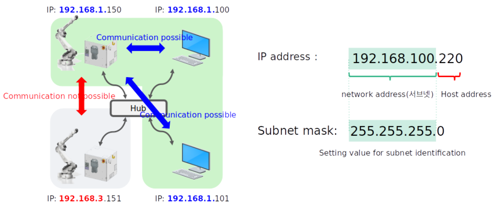
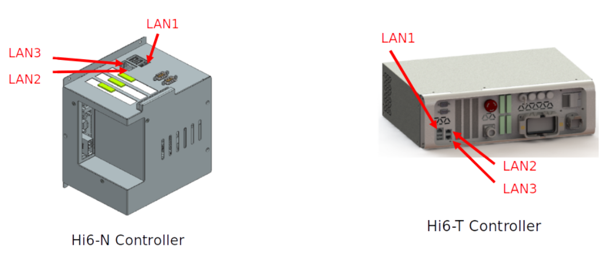
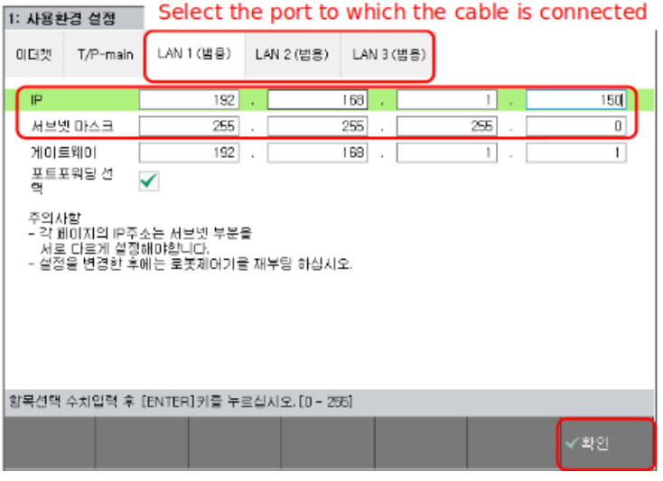
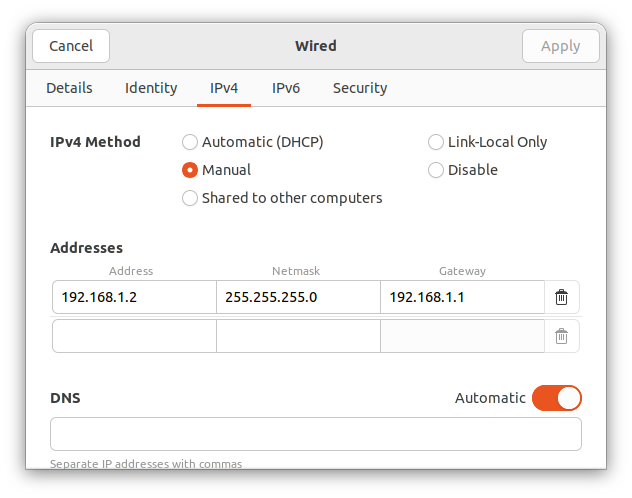
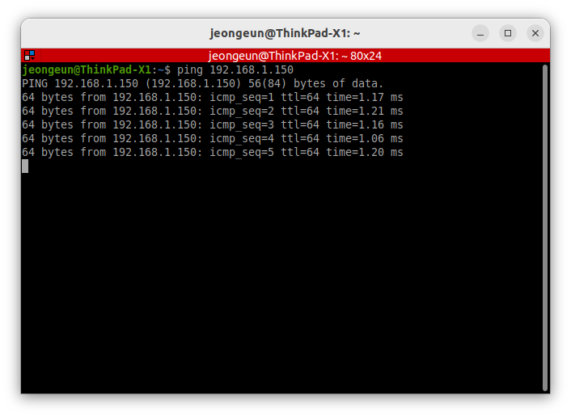
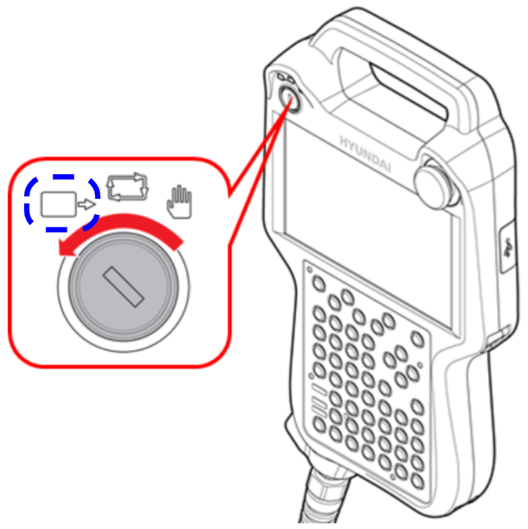
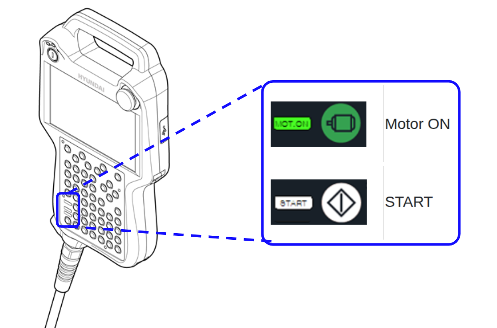

# HDR ROS2 Driver

#### Table of Contents

- [Overview](#overview)
- [Package Structure](#package-structure)
- [Preparation](#preparation)
- [Usage](#usage)
- [Troubleshooting](#troubleshooting)

---

## 1. Overview

The `hdr_ros2_driver` package provides a ROS2 service node for interfacing with HD Hyundai Robotics' Open API. This node enables communication with the robot controller via HTTP-based RESTful API, exposing various robot control and monitoring functions as ROS2 services. For joint state streaming and trajectory control, use this package together with `hdr_hardware_interface` (ros2_control).

---

## 2. Package Structure

| Directory           | Description                                   |
|---------------------|-----------------------------------------------|
| `launch/`           | Launch files for starting the driver node.     |
| `src/`              | Source code of the ROS2 driver implementation. |
| `include/`          | Header files for the driver.                   |
| `test/`             | Scripts for service testing.                   |

---

## 3. Preparation


### Hi6 Controller Ethernet Communication

This section describes how to interface with external equipment over Ethernet using UDP/IP and TCP/IP protocols.
Communication is handled via the `enet` module, which is included as a standard feature on the Hi6 controller.
Refer to the diagram below for the basic Ethernet communication setup.<br>
**LAN communication:** This allows data exchange either within the same network or with an external host or PC.


<div align="left"></div>

#### Cable Connection
Connect the Ethernet cable for external communication to one of the available user Ethernet ports.
You may choose from LAN1, LAN2, or LAN3, depending on your controller model:<br>
- Hi6-N controller: Ports are located at the top of the main module on the door middle panel.
- Hi6-T controller: Use the front Ethernet port on the controller.

**Recommendation**: Connect to LAN1, which is typically configured with an IP address in the 192.168.1.x range.

<div align="left"></div>


#### Controller Network Settings
> ❗**Note:** If the PC and controller are connected via `LAN1`, and there is no need to change the controller's default IP address, this step may be omitted.

Set the IP address of the Hi6 controller using the teaching pendant.


1. [F2:System] → [2:Control Parameters] → [9:Network]
2. [1:Environment Settings] → Click [LAN# (General)] where the cable is connected
3. Enter IP address and subnet mask.<br>
→ Assign values and select gateway and port forwarding if necessary.
4. After setting, press [F7:Confirm] → Reboot the controller.

<div align="left"></div>


#### PC Network Settings

Configure the IP address of the PC.<br>
If the PC is connected to the controller via LAN1, and the controller’s IP address remains unchanged (default: 192.168.1.150), then the PC can be configured as follows:<br>
Set the PC’s IP address to a value in the 192.168.1.x range, and ensure that the Netmask and Gateway match those of the controller.

<div align="left"></div>

After completing the configuration, open a terminal and perform a ping test to verify that the connection between the PC and the controller is working properly.

<div align="left"></div>

---

## 4. Usage

### Example

#### Setting the operation mode
Before launching the ROS2 driver, you must set the teach pendant to **Remote Mode**.
To do this, turn the mode switch on the Hi6 teach pendant to the remote mode.
<div align="left"></div>
Once switched, confirm that the status bar on the teach pendant screen displays remote mode.

> ❗**Note:** If the operation mode is not set to remote, the ROS2 driver will fail to start and throw an error.
Make sure this step is complete before proceeding.

#### Launching the Driver
You can now launch the ROS2 service node using the following commands:
```bash
# Launch with default parameters
ros2 launch hdr_ros2_driver hdr_ros2_driver.launch.py

# Launch with custom IP for the OpenAPI server
ros2 launch hdr_ros2_driver hdr_ros2_driver.launch.py \
  openapi_ip:=192.168.0.10
```
<div align="left"></div>
If everything is configured correctly:

- The Motor ON button (green LED) will blink, indicating that power is being enabled.
- The START button (white LED) will turn on, showing that the system is ready for operation.

#### Configuration Options

| Argument name           | Type     | Default                          | Description                                      |
|-------------------------|----------|----------------------------------|--------------------------------------------------|
| `openapi_ip`            | string | `192.168.1.150`                  | IP address of robot's OpenAPI server             |

### Services

The driver provides the following service categories:

#### Version Information

| Service Name | Service Type | Description | Usage |
|--------------|--------------|-------------|-------|
| `/hdr_ros2_driver/get/api_ver` | std_srvs::srv::Trigger | Get the API version | `ros2 service call /hdr_ros2_driver/get/api_ver std_srvs/srv/Trigger` |
| `/hdr_ros2_driver/get/system_ver` | std_srvs::srv::Trigger | Get the system version | `ros2 service call /hdr_ros2_driver/get/system_ver std_srvs/srv/Trigger` |

#### Project Management

| Service Name | Service Type | Description | Usage |
|------------|------------|------|----------|
| `/hdr_ros2_driver/project/get/rgen` | std_srvs::srv::Trigger | Get robot generation information | `ros2 service call /hdr_ros2_driver/project/get/rgen std_srvs/srv/Trigger` |
| `/hdr_ros2_driver/project/get/jobs_info` | std_srvs::srv::Trigger | Get job information | `ros2 service call /hdr_ros2_driver/project/get/jobs_info std_srvs/srv/Trigger` |
| `/hdr_ros2_driver/project/post/reload_updated_jobs` | std_srvs::srv::Trigger | Reload updated jobs | `ros2 service call /hdr_ros2_driver/project/post/reload_updated_jobs std_srvs/srv/Trigger` |
| `/hdr_ros2_driver/project/post/delete_job` | hdr_msgs::srv::FilePath | Delete a job | `ros2 service call /hdr_ros2_driver/project/post/delete_job hdr_msgs/srv/FilePath "{path: '0001.job'}"` |

#### Control System

| Service Name | Service Type | Description | Usage |
|--------------|--------------|-------------|-------|
| `/hdr_ros2_driver/control/get/op_cnd` | std_srvs::srv::Trigger | Get operation condition | `ros2 service call /hdr_ros2_driver/control/get/op_cnd std_srvs/srv/Trigger` |
| `/hdr_ros2_driver/control/get/ucs_nos` | std_srvs::srv::Trigger | Get user coordinate system numbers | `ros2 service call /hdr_ros2_driver/control/get/ucs_nos std_srvs/srv/Trigger` |
| `/hdr_ros2_driver/control/put/op_cnd` | hdr_msgs::srv::OpCnd | Set operation condition | `ros2 service call /hdr_ros2_driver/control/put/op_cnd hdr_msgs/srv/OpCnd "{playback_mode: 1, step_goback_max_spd: 130, ucrd_num: 2}"` |

#### Robot Control

| Service Name | Service Type | Description | Usage |
|--------------|--------------|-------------|-------|
| `/hdr_ros2_driver/robot/get/motor_state` | std_srvs::srv::Trigger | Get the current motor state | `ros2 service call /hdr_ros2_driver/robot/get/motor_state std_srvs/srv/Trigger` |
| `/hdr_ros2_driver/robot/get/po_cur` | hdr_msgs::srv::PoseCur | Get current position | `ros2 service call /hdr_ros2_driver/robot/get/po_cur hdr_msgs/srv/PoseCur "{task_no: 0, crd: 0, ucrd_no: 0, mechinfo: false}"` |
| `/hdr_ros2_driver/robot/get/cur_tool` | std_srvs::srv::Trigger | Get the current tool information | `ros2 service call /hdr_ros2_driver/robot/get/cur_tool std_srvs/srv/Trigger` |
| `/hdr_ros2_driver/robot/get/tools` | std_srvs::srv::Trigger | Get a list of available tools | `ros2 service call /hdr_ros2_driver/robot/get/tools std_srvs/srv/Trigger` |
| `/hdr_ros2_driver/robot/get/tools_t` | hdr_msgs::srv::Number | Get tool information with transformation data | `ros2 service call /hdr_ros2_driver/robot/get/tools_t hdr_msgs/srv/Number "{data: 0}"` |
| `/hdr_ros2_driver/robot/get/emergency` | std_srvs::srv::Trigger | Get emergency stop status | `ros2 service call /hdr_ros2_driver/robot/get/emergency std_srvs/srv/Trigger` |
| `/hdr_ros2_driver/robot/post/motor_power` | std_srvs::srv::Trigger | Turn motor power on/off | `ros2 service call /hdr_ros2_driver/robot/post/motor_power std_srvs/srv/Trigger` |
| `/hdr_ros2_driver/robot/post/operation` | std_srvs::srv::SetBool | Control robot job execution (start/stop) | `ros2 service call /hdr_ros2_driver/robot/post/operation std_srvs/srv/SetBool "{data: true}"` |
| `/hdr_ros2_driver/robot/post/tool_no` | hdr_msgs::srv::Number | Set the current tool number | `ros2 service call /hdr_ros2_driver/robot/post/tool_no hdr_msgs/srv/Number "{data: 0}"` |
| `/hdr_ros2_driver/robot/post/crd_sys` | hdr_msgs::srv::Number | Set coordinate system | `ros2 service call /hdr_ros2_driver/robot/post/crd_sys hdr_msgs/srv/Number "{data: 0}"` |
| `/hdr_ros2_driver/robot/post/emergency_stop` | std_srvs::srv::Trigger | Trigger emergency stop | `ros2 service call /hdr_ros2_driver/robot/post/emergency_stop std_srvs/srv/Trigger` |
| `/hdr_ros2_driver/robot/post/emergency_stop_test` | hdr_msgs::srv::Emergency | Execute emergency stop test | `ros2 service call /hdr_ros2_driver/robot/post/emergency_stop_test hdr_msgs/srv/Emergency "{step_no: 1, stop_at: 50, stop_at_corner: 0, category: 1}"` |
| `/hdr_ros2_driver/robot/get/joint_traj_buff_avail`| std_srvs::srv::Trigger | Get available size of joint trajectory buffer | `ros2 service call /hdr_ros2_driver/robot/get/joint_traj_buff_avail std_srvs/srv/Trigger` |
| `/hdr_ros2_driver/robot/post/init_joint_trajectory` | std_srvs::srv::Trigger | Initialize (clear) the joint trajectory buffer | `ros2 service call /hdr_ros2_driver/robot/post/init_joint_trajectory std_srvs/srv/Trigger` |
| `/hdr_ros2_driver/robot/post/insert_joint_trajectory_points` | hdr_msgs::srv::JointTrajectoryPoints | Insert joint trajectory points into controller buffer | `ros2 service call /hdr_ros2_driver/robot/post/insert_joint_trajectory_points hdr_msgs/srv/JointTrajectoryPoints "{ trajectory: { joint_names: ['j1','j2','j3','j4','j5','j6'], points: [ { positions: [0.0,1.5708,0,0,0,0], time_from_start: {sec: 0, nanosec: 0}}, { positions: [0.05,1.5708,0,0,0,0], time_from_start: {sec: 3, nanosec: 0}} ] } }"` |

####  PLC Communication

| Service Name | Service Type | Description | Usage |
|------------|------------|------|----------|
| `/hdr_ros2_driver/plc/get/relay_value` | hdr_msgs::srv::IoplcGet | Get relay values | `ros2 service call /hdr_ros2_driver/plc/get/relay_value hdr_msgs/srv/IoplcGet "{type: 'M', st: 100, len: 10}"` |
| `/hdr_ros2_driver/control/get/ios/dio` | hdr_msgs::srv::IoRequest | Get digital I/O values | `ros2 service call /hdr_ros2_driver/control/get/ios/dio hdr_msgs/srv/IoRequest "{type: 'di', blk_no: 1, sig_no: 1}"` |
| `/hdr_ros2_driver/control/get/ios/sio` | hdr_msgs::srv::IoRequest | Get serial I/O values | `ros2 service call /hdr_ros2_driver/control/get/ios/sio hdr_msgs/srv/IoRequest "{type: 'si', sig_no: 1}"` |
| `/hdr_ros2_driver/plc/post/relay_value` | hdr_msgs::srv::IoplcPost | Set relay values | `ros2 service call /hdr_ros2_driver/plc/post/relay_value hdr_msgs/srv/IoplcPost "{name: 'fb1.do0', value: 1}"` |
| `/hdr_ros2_driver/control/post/ios/dio` | hdr_msgs::srv::IoRequest | Set digital I/O values | `ros2 service call /hdr_ros2_driver/control/post/ios/dio hdr_msgs/srv/IoRequest "{type: 'do', blk_no: 1, sig_no: 1, val: 1}"` |

#### File Management

| Service Name | Service Type | Description | Usage |
|--------------|--------------|-------------|-------|
| `/hdr_ros2_driver/file/get/files` | hdr_msgs::srv::FilePath | Get file content | `ros2 service call /hdr_ros2_driver/file/get/files hdr_msgs/srv/FilePath "{path: 'project/jobs/0001.job'}"` |
| `/hdr_ros2_driver/file/get/file_info` | hdr_msgs::srv::FilePath | Get information about a specific file | `ros2 service call /hdr_ros2_driver/file/get/file_info hdr_msgs/srv/FilePath "{path: 'project/jobs/0001.job'}"` |
| `/hdr_ros2_driver/file/get/file_list` | hdr_msgs::srv::FileList | Get a list of files in a directory | `ros2 service call /hdr_ros2_driver/file/get/file_list hdr_msgs/srv/FileList "{path: 'project/jobs', incl_file: true, incl_dir: false}"` |
| `/hdr_ros2_driver/file/get/file_exist` | hdr_msgs::srv::FilePath | Check if a file exists | `ros2 service call /hdr_ros2_driver/file/get/file_exist hdr_msgs/srv/FilePath "{path: 'project/jobs/0001.job'}"` |
| `/hdr_ros2_driver/file/post/rename_file` | hdr_msgs::srv::FileRename | Rename a file | `ros2 service call /hdr_ros2_driver/file/post/rename_file hdr_msgs/srv/FileRename "{pathname_from: 'project/jobs/0001.job', pathname_to: 'project/jobs/4321.job'}"` |
| `/hdr_ros2_driver/file/post/mkdir` | hdr_msgs::srv::FilePath | Create a new directory | `ros2 service call /hdr_ros2_driver/file/post/mkdir hdr_msgs/srv/FilePath "{path: '/project/jobs/special'}"` |
| `/hdr_ros2_driver/file/post/files` | hdr_msgs::srv::FileSend | Upload files | `ros2 service call /hdr_ros2_driver/file/post/files hdr_msgs/srv/FileSend "{target_file: 'project/jobs/test.job', source_file: '/home/test/test.job'}"` |
| `/hdr_ros2_driver/file/delete/files` | hdr_msgs::srv::FilePath | Delete files | `ros2 service call /hdr_ros2_driver/file/delete/files hdr_msgs/srv/FilePath "{path: 'project/jobs/0001.job'}"` |

#### Task Management

| Service Name | Service Type | Description | Usage |
|------------|------------|------|----------|
| `/hdr_ros2_driver/task/post/cur_prog_cnt` | hdr_msgs::srv::ProgramCnt | Set current program count | `ros2 service call /hdr_ros2_driver/task/post/cur_prog_cnt hdr_msgs/srv/ProgramCnt "{pno: 1, sno: 0, fno: 0, ext_sel: 0}"` |
| `/hdr_ros2_driver/task/post/reset` | std_srvs::srv::Trigger | Reset task execution | `ros2 service call /hdr_ros2_driver/task/post/reset std_srvs/srv/Trigger` |
| `/hdr_ros2_driver/task/post/assign_var` | hdr_msgs::srv::ProgramVar | Assign variable values | `ros2 service call /hdr_ros2_driver/task/post/assign_var hdr_msgs/srv/ProgramVar "{name: 'a', scope: 'local', expr: '14 + 2', save: true}"` |
| `/hdr_ros2_driver/task/post/release_wait` | std_srvs::srv::Trigger | Release a wait state | `ros2 service call /hdr_ros2_driver/task/post/release_wait std_srvs/srv/Trigger` |
| `/hdr_ros2_driver/task/post/set_cur_pc_idx` | hdr_msgs::srv::Number | Set current program counter index | `ros2 service call /hdr_ros2_driver/task/post/set_cur_pc_idx hdr_msgs/srv/Number "{data: 0}"` |
| `/hdr_ros2_driver/task/post/solve_expr` | hdr_msgs::srv::ProgramVar | Solve an expression | `ros2 service call /hdr_ros2_driver/task/post/solve_expr hdr_msgs/srv/ProgramVar "{scope: 'local', expr: 'a + 10'}"` |
| `/hdr_ros2_driver/task/post/execute_move` | hdr_msgs::srv::ExecuteMove | Execute a move command | `ros2 service call /hdr_ros2_driver/task/post/execute_move hdr_msgs/srv/ExecuteMove "{task_no: 0, stmt: 'move SP,spd=1sec,accu=0,tool=1 [0, 90, 0, 0, 0, 0]'}"` |

#### Console and System

| Service Name | Service Type | Description | Usage |
|------------|------------|------|----------|
| `/hdr_ros2_driver/console/post/execute_cmd` | hdr_msgs::srv::ExecuteCmd | Execute console commands | `ros2 service call /hdr_ros2_driver/console/post/execute_cmd hdr_msgs/srv/ExecuteCmd "{cmd_line: ['rl.stop'], period_ms: 100}"` |
| `/hdr_ros2_driver/clock/get/date_time` | std_srvs::srv::Trigger | Get system date and time | `ros2 service call /hdr_ros2_driver/clock/get/date_time std_srvs/srv/Trigger` |
| `/hdr_ros2_driver/clock/put/date_time` | hdr_msgs::srv::DateTime | Set system date and time | `ros2 service call /hdr_ros2_driver/clock/put/date_time hdr_msgs/srv/DateTime "{year: 2025, mon: 5, day: 13, hour: 14, min: 30, sec: 0}"` |
| `/hdr_ros2_driver/log/get/manager` | hdr_msgs::srv::LogManager | Get log manager information | `ros2 service call /hdr_ros2_driver/log/get/manager hdr_msgs/srv/LogManager "{n_item: 50, cat_p: 'E,W,N', id_min: 0, ts_min: '2025/05/01 00:00:00.000', ts_max: '2025/05/13 23:59:59.999'}"` |

### Test

#### Service Test

> **⚠️ Pre-Test Requirements:**
> Before running the service test, make sure the following conditions are met:
>
> * The controller must be in **REMOTE mode**.
> * A global variable `a` must be initialized in the controller environment.
> * On the TP, navigate to **System → User Environment → wait(di/wi)** and **disable the forced wait option**.
> * **For `emergency_stop_test` (category: `robot`):** A job file containing position values must be running on the TP.

Available service categories for testing:

```bash
python3 test/test_hdr_ros2_driver.py [category]
```

Available categories:

| Category     | Description                              |
|--------------|------------------------------------------|
| `all`        | Calls all available services             |
| `version`    | Version-related services                 |
| `control`    | Control-related services                 |
| `robot`      | Robot state and control services         |
| `plc`        | PLC communication-related services       |
| `task`       | Task-related services                    |
| `console`    | Command execution services               |
| `file`       | File upload/view/delete operations       |
| `project`    | Project (JOB)-related services           |
| `etc`        | Log, date/time configuration, etc.       |

```bash
# Example testing robot services
python3 $(ros2 pkg prefix hdr_ros2_driver)/share/hdr_ros2_driver/test/test_hdr_ros2_driver.py robot
```

---

## 5. Troubleshooting

- **Connection Problems**: Verify IP address, port, and network connectivity
- **Timeouts**: Ensure the robot controller is online and accessible
- **Service Failures**: Check the controller configuration to ensure all required files and variables are present
- **Service not found**: Confirm that the correct driver version is installed and that your ROS2 overlay environment is properly sourced (`source install/setup.bash`)

For detailed API documentation, refer to the [Open API Documentation](https://hrbook-hrc.web.app/#/view/doc-hi6-open-api/english/).

---

## Maintainers and License

- **Maintainer**: HD Hyundai Robotics R&D Team
- **License**: This project is licensed under the BSD 3-Clause License - see the [LICENSE](LICENSE)
- **Contact**: [kwon.hyojun@hd.com]
